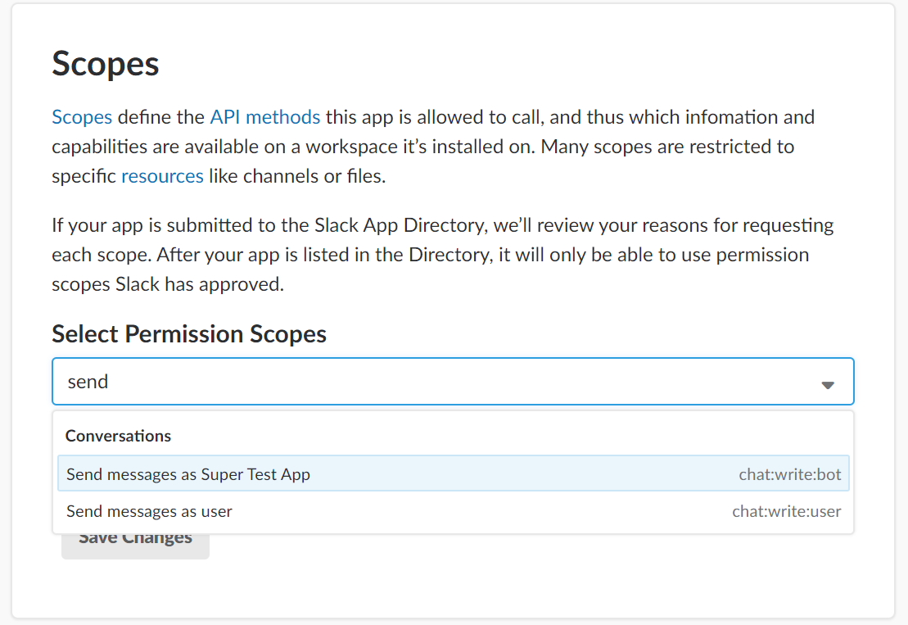

# Writing to a Slack Channel - Python Edition
Note: This tutorial is part of CodeProject's [Slack API Challenge](https://www.codeproject.com/Competitions/1069/Slack-API-Challenge.aspx). If you haven't already worked through the [introductory article](https://www.codeproject.com/Articles/1272958/Creating-Your-First-Slack-App) and created your Slack app, please do that now, as this tutorial builds on the first one.

In this article, we’ll be creating a simple Python application that can write to a Slack channel. If you haven’t completed the first tutorial in this series where you learn about Slack’s APIs and create your first workspace and application, please do that first. (add link when posted)

To keep things nice and simple, we’re going to be using Slack’s Web API. This means that all we’ll need to be able to do to write to a Slack channel is make HTTP POST requests. Since this functionality is built into Node’s standard library, creating our app will be quick and easy.

## Getting Started
If you don't already have it installed, you'll need Python 3.6 or later. While it's likely this code will work on older versions of Python, it hasn't been tested. 

To get started, we'll need to install our app into our Slack workspace, which will give us an access token we can use to post messages to channels in the workspace. Start by finding your app's admin page by navigating to the [Slack API apps page](https://api.slack.com/apps) and then clicking on your app in the the list that appears. 

When your app's admin page loads, click on 'OAuth and Permissions' in the menu on the left. When this page loads, scroll down to 'Scopes'. You'll need to add at least one scope before you'll be able to generate an access token. This makes sense, because without any authorized scopes, your app wouldn't be allowed to do anything, and an access token that grants you the ability to do nothing at all wouldn't be very useful! 

Click on the drop down box to see a list of scopes you can add. The one you're looking for is 'Send messages as Super Amazing Test App', though instead of Super Amazing Test App, you'll see whatever super amazing name you gave your own application. It should look something like this:



Once you've added this scope, you'll be able to install the app to your workspace. Scroll back up to the top of the 'OAuth & Permissions' page, and you'll see a nice inviting green button you can click:


Click it, and you'll be taken to a screen asking you to give you app access to your workspace. Authorize it, and your OAuth & Permission page will now contain an access token:


Instead of a black box, you'll see your very own access token here. Kepe this open in a browser tab, because you're going to need this access token in a minute.

Now that we have the information we need, we can move on to writing the code that will make our app work.

## The Code
Here comes the fun part! 

First, open up a terminal or command prompt, and make a new directory for your app:
```
mkdir slack-app
```
Then change to the new directory, and run npm init:
```
cd slack-app
pip install requests
```
Astute readers will note that this installs the `requests` library globally. On larger Python projects, you'll want to use `pipenv` and have all of your dependencies self-contained in your app's directory. But since this is an introductory tutorial, we're keeping things simple.

This might seem a little underwhelming. I mean, we're trying to create a super amazing Slack app, and we only installed one package? What gives?!? And it gets worse! We could write to a Slack channel without installing any dependencies at all! The requests library is just a nice HTTP client that will make our lives a little easier. 

Now, open the directory in a text editor. Visual Studio Code is a free editor that works on Windows, MacOS, and Linux, and it’s a great choice if you’re not sure what to you. But if you have another editor you already prefer for Python, go right ahead and use that instead. 

In your `slack-app` directory, create a new file named `app.py`. Add the following code to `app.py`:
```
import requests
import json

url = "https://slack.com/api/chat.postMessage"
token = "your-token-goes-here"
```
We don't have much yet, but we're off to a good start! We've imported the `requests` and `json` libraries, and defined the URL and access token that we'll be using. Remember that access token we generated earlier when we installed the app in our workspace? This is where you'll want to put it in place of `your-token-goes-here`. 

In a real, production-ready app, you'd want to store your app's secrets somewhere a little more secure than this; some people like to save secrets into an environment variables on the server where the app runs, and others use solutions like Kubernetes secrets or the AWS secrets manager.

Just remember not to commit your access token to a public GitHub repo, unless you want everyone in the world to know it. In our case, all that could happen would be that all of the world's trolls could gleefulyl post message to our Slack workspace. This wouldn't exactly be a huge security breach, but it would sure be annoying. 

What comes next? As it stands, our app is pretty boring and it doesn't do anything. So let's write a function to send messages to Slack! Add the following code to `app.py`:

```
headers = {
  "Content-Type": "application/json",
  "Authorization": "Bearer {0}".format(token)
}

def send_message(message_text):
  message = {
    "channel": "#general",
    "text": message_text
  }

  requests.post(url, headers=headers, data=json.dumps(message))
```
And with that block of code, we've completed our entire Slack API message poster. Whenever you call this function and pass it a message, it will write the message to the #general channel in our Slack workspace.

For fun, let's add one more chunk of code so we can see that our Slack message poster actually works:

```
send_message("Hello from Python!");
```

Here, we're just calling our friendly `send_message` function and asking it to post a message for us. If we're signed in the our Slack workspace and we check the #general channel, we'll see that our app has indeed posted our message:


## We're all done!
And that's it! You've written your first Slack API app. That was pretty easy, wasn't it?

Now for the really good news: you can officially add 'Slack API Developer' to your LinkedIn profile, and look forward to an avalanche of messages from recruiters telling you that you're the perfect candidate for a role they're trying to fill!


